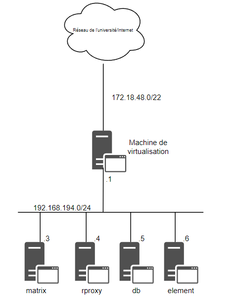

## Nous allons donc maintenant passé à l'installation de l'architecture finale.

## 1) Installation basique

Dans un premier temps vous allez devoir recréer votre machine `matrix` mais aussi créer deux nouvelles machines qui se nommeront `db` (pour la base de données) et `element` (pour l'installation d'element et de son serveur web).

Pour ce qui est de leur configuration je vous conseille de suivre la procédure [sur la création d'une vm.](./creation_vm.md) tout en respectant l'architecture ci-dessous.

>Attention lorsque vous modifierez le fichier `/etc/hosts`, il faudra le modifier comme ceci en ajoutant les autres machines pour qu'elles puissent communiquer entre elles.:

```                              
127.0.0.1       localhost
127.0.1.1       matrix <- ici
192.168.194.4   rproxy
192.168.194.5   db
192.168.194.6   element
``` 


 


## 2) Postgresql

Maintenant sur votre machine `db` vous devrez installer [postgresql et le lier avec synapse avec la partie 1.3](./installation_synapse.md) avant de suivre cette documentation veillez à bien installer postgresql avant :

    root@db # apt install postgresql

Une fois ceci fait il faut encore y faire quelque modification.

Tout d'abord il vous faudra modifier les fichier `/etc/postgresql/13/main/postgresql.conf` et `/etc/postgresql/13/main/pg_hba.conf`

dans `/etc/postgresql/13/main/postgresql.conf` il faut décommenter `Listen_adresses` et le modifier comme ceci :

    listen_adresses = '*'

dans `/etc/postgresql/13/main/pg_hba.conf` il faut ajouter dans la partie `IPV4` : 

    host  matrix  matrix 192.168.194.0/24  md5

Et pour finir il vous suffit de restart `postgresql`

    root@db $ systemctl restart postgresql


## 3) Synapse
 Une fois toute les machines créer avec la configuration basique nécessaire vous devrais maintenant installer [Synapse](./installation_synapse.md) sur votre machine matrix avec comme server_name : `virtu.iutinfo.fr:9090` en remplaçant virtu par le nom de votre machine de virtualisation.

 Il vous faudra aussi modifier dans `/etc/matrix-synapse/homeserver.yaml` le `listeners` ainsi que la `database` :

    listeners:
        - port: 9090
        tls: false
        type: http
        x_forwarded: true
        bind_addresses: ['::1','127.0.0.1','192.168.194.3']
        ressources:
            - names: [client, federation]
            compress: false
    database:
    name: psycopg2
    args:
        user: matrix
        password: matrix
        database: matrix
        host: 192.168.194.5
        cp_min: 5
        cp_max: 10

> Penser à bien supprimer cette ligne `database: /var/lib/matrix-synapse/homeserver.db`

Pour finir on redémarre Synapse :
    user@matrix $ sudo systemctl restart matrix-synapse


## 4) Le rproxy

Normalement si vous êtes ici c'est que vous avez suivi toute la documentation depuis le début mais comme on ne sait jamais si vous ne disposez pas de la machine rproxy suivez cette [documentation](./installation_reverse_proxy.md).

Ensuite il vous faudra modifer le fichier `etc/nginx/sites-available/default`

        server {
            listen 9090;
            listen [::]:9090;

            server_name acajou13.iutinfo.fr;

        location / {
            proxy_pass http://192.168.194.3:9090;
            proxy_set_header Host $http_host;
            proxy_set_header X-Real-IP $remote_addr;
            proxy_set_header X-Forwarded-For $proxy_add_x_forwarded_for;
            proxy_set_header X-Forwarded-Proto $scheme;
        }
    }
        server {
            listen 9090;
            listen [::]:9090;

            server_name acajou13.iut-infobio.priv.univ-lille1.fr;

        location / {
            proxy_pass http://192.168.194.6:8080;
            proxy_set_header Host $http_host;
            proxy_set_header X-Real-IP $remote_addr;
            proxy_set_header X-Forwarded-For $proxy_add_x_forwarded_for;
            proxy_set_header X-Forwarded-Proto $scheme;
        }
    }

## 4) Element

Pour l'installation de [element](./installation_element.md) il vous faut juste suivre la documentation et faire une toute petite modif dans le fichier `/etc/apache2/sites-available/websites.conf` :

    <VirtualHost *:8080>


## 5) Le .ssh/config

Pour finir il vous faudra modifier votre fichier `.ssh/config` :

    Host vm
        User user
        HostName 192.168.194.3
        ForwardAgent yes

    Host rproxy
        User user
        HostName 192.168.194.4
        LocalForward 0.0.0.0:9090 localhost:9090
        ForwardAgent yes