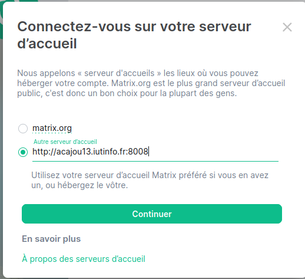
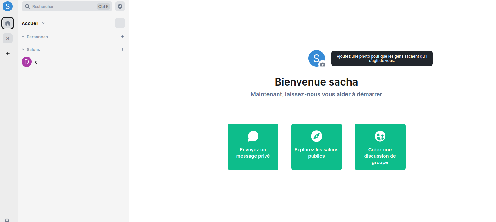
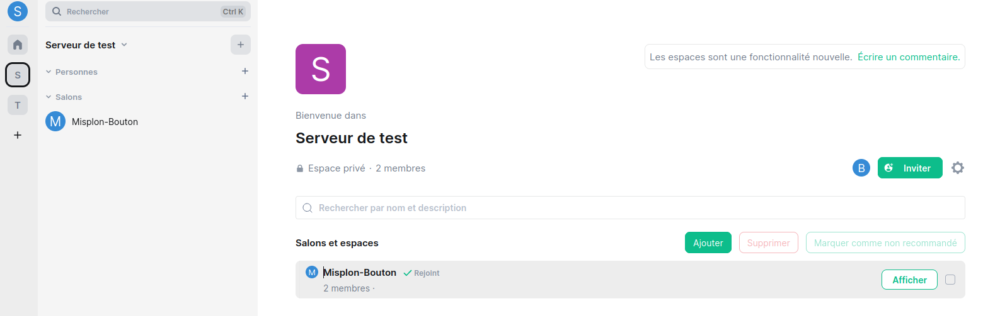
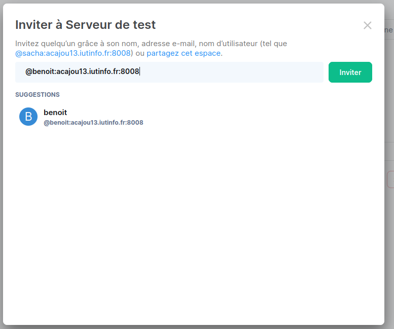
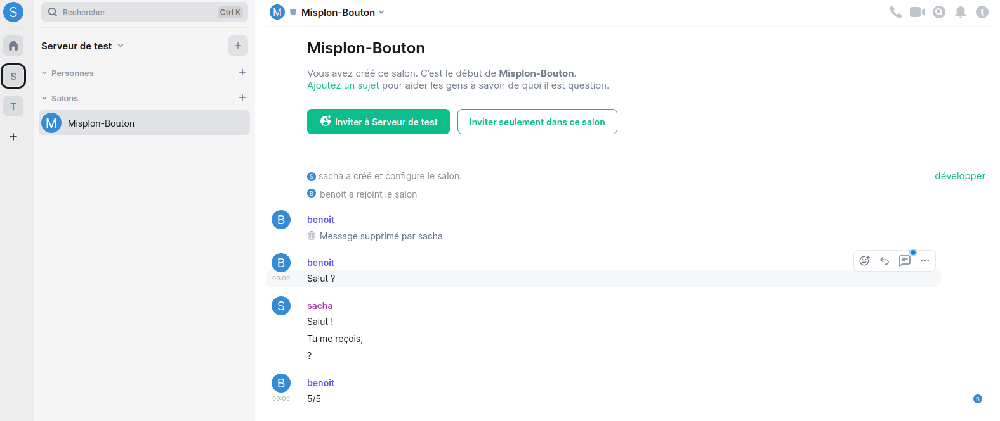

## Conditions pour effectuer la procédure : 
-   Avoir une [machine virtuelle basique fonctionnelle](./creation_vm.md).
-   Avoir connaissance du [vocabulaire technique](./introduction_et_vocabulaire.md).
-   Avoir une [base de données basique fonctionnelle](./installation_bdd.md).
-   Avoir effectué le [premier accès au service http](./acces_au_service_http.md) pour comprendre le fonctionnement.


### 1) Installation du paquet sous Debian

Premièrement, il nous faut installer Synapse, pour se faire on se rend sur leur site et plus précisement dans le [guide d'installation sous Debian](https://matrix-org.github.io/synapse/latest/setup/installation.html#matrixorg-packages)

Il suffit de rentrer les 4 commandes suivantes : 

```
user@vm $ sudo -E apt install -y lsb-release wget apt-transport-https
user@vm $ sudo -E wget -O /usr/share/keyrings/matrix-org-archive-keyring.gpg https://packages.matrix.org/debian/matrix-org-archive-keyring.gpg
echo "deb [signed-by=/usr/share/keyrings/matrix-org-archive-keyring.gpg] https://packages.matrix.org/debian/ $(lsb_release -cs) main" |
    sudo tee /etc/apt/sources.list.d/matrix-org.list
user@vm $ sudo -E apt update
user@vm $ sudo -E apt install matrix-synapse-py3
```

Le serveur écrira ses messages à destination de l’administrateur (les logs) dans le fichier <span style="color:salmon">/var/log/matrix-synapse/homeserver.log.virtualisation</span>.

### 1.2) Paramétrage spécifique pour une instance dans un réseau privé

Pour que notre serveur ne contacte aucun autre serveurs, il faut enlever les paramètres de la ligne <span style="color:salmon">trusted_key_servers</span> dans le fichier <span style="color:salmon">/etc/matrix-synapse/homeserver.yaml</span>.
```
user@vm $ sudo nano /etc/matrix-synapse/homeserver.yaml
Remplacer par trusted_key_servers: []
``` 

Ne pas oubliez de supprimer les serveurs <span style="color:salmon">déjà connus</span> auparavant (**ligne en dessous**).Synapse

### 1.3) Utilisation d'une base Postgres
[Doc utilisation postgres synapse](https://matrix-org.github.io/synapse/latest/postgres.html)

La bibliothèque C libpq permet aux programmes de communiquer avec le serveur de base de données PostgreSQL, elle est nécessaire au bon fonctionnement de postgres.
```
user@vm $ sudo apt install libpq5
``` 
Ensuite, on se place en tant qu'utilisateur postgres : 
``` 
su - postgres
``` 
On détruit notre base de données au préalable créer : 
``` 
dropdb matrix
``` 
On détruit également l'utilisateur qu'on avait créer avec : 
``` 
dropuser matrix
``` 
On créer un nouvel utilisateur avec l'argument <span style="color:salmon"> --pwprompt</span>, pour pouvoir créer son mot de passe : 
``` 
createuser --pwprompt synapse_user
``` 
On recréer ensuite une base de données avec les arguments suivants :
- <span style="color:salmon"> --encoding</span> : Spécifiie l'encodage utilisé, ici **UTF-8**
- <span style="color:salmon"> --locale</span> : Spécifie l'endroit où doit être utilisé la base de données.
- <span style="color:salmon"> --template</span> : Spécifie la template a utilisé sur notre base de données, après recherche, on utilise **template0** sur des bases de données où les tables ne vont plus changer.
- <span style="color:salmon"> --owner</span> : Pour spécifier le propriétaire de la table, ici synapse_user que l'on vient de créer.
``` 
createdb --encoding=UTF8 --locale=C --template=template0 --owner=synapse_user synapse
``` 

Afin que notre serveur Synapse utilise par défaut une base de données <span style="color:salmon"> postgresql</span>, et non pas une base de données <span style="color:salmon"> sqlite</span>.
Il faut encore une fois modifier le fichier <span style="color:salmon">/etc/matrix-synapse/homeserver.yaml</span>, et changer la configuration du paramètre **database** comme ci-dessous : 

    database:
        name: psycopg2
        args:
            user: synapse_user
            password: synapse
            database: synapse
            host: 127.0.0.1
            cp_min: 5
            cp_max: 10


On **redémarre** synapse : 
```
user@vm $ sudo systemctl restart matrix-synapse
```

Dans le fichier <span style="color:salmon">/etc/matrix-synapse/homeserver.yaml</span>, on rajoute aussi la ligne  :

    registration_shared_secret: "synapse"


### 1.4 ) Création d'utilisateur
Pour créer un utilisateur on utilise la commande <span style="color:salmon">sudo register_new_matrix_user</span> avec comme arguments : 
- <span style="color:salmon">-u</span> : Pour renseigner le nom d'utilisateur.
- <span style="color:salmon">-p</span> : Pour renseigner le mot de passe de l'utilisateur.
- <span style="color:salmon">-a</span> : Pour créer l'utilisateur en tant qu'**admin**.
- <span style="color:salmon">-c</span> : Le chemin vers le fichier contenant le *shared_secret*.
```
user@vm $ sudo register_new_matrix_user -u [nom] -p [password] -a -c /etc/matrix-synapse/homeserver.yaml
```

Si on veut créer 2 utilisateurs, on répète deux fois la commande , en changeant le nom d'utilisateur (on peut avoir le même mot de passe cependant)

### 1.5) Connexion à votre serveur Matrix 

Premièrement, on peut déjà ouvrir le site mis à disposition, [ici](http://tp.iutinfo.fr:8888/).

Avant de faire quoi que ce soit sur le site, il faut d'abord sortir de la *machine virtuelle* et se rendre sur notre *machine physique*, afin de modifier nos scripts créer précedemment dans la <span style="color:salmon">Procédure 1</span> : 

```
login@phy $ nano .ssh/config
```

Puis, dans le script VM, on rajoute les deux lignes suivantes  : 
```
LocalForward 0.0.0.0:8080 192.168.194.3:8080
LocalForward 0.0.0.0:8008 localhost:8008
```

On peut ensuite **revenir** sur notre *machine virtuelle*.

<span style="color:salmon">**Attention :**</span>
Il faut donc bien se connecter en utilisant le <span style="color:salmon">ssh vm</span>, sinon le script ne sera pas utilisé et le serveur ne sera pas opérationnel.

On peut maintenant s'occuper du site, si on clique sur le lien on arrive sur la page d'accueil avec une proposition de se connecter, ce qui va nous interesser est le <span style="color:salmon">serveur d'accueil</span>.

</img>
Il faut modifier le serveur d'accueil de tel sorte qu'il respecte le schéma suivant
```
http://[machine].iutinfo.fr:8008
```
Si votre serveur est <span style="color:salmon">lancé correctement</span>, cela devrait s'afficher en vert.
</img>

Ensuite, on peut appuyer sur **Continuer** et rentrer les logins utilisateurs créer au préalable, pour ma part 
**id : Sacha pswrd : sacha**.

On arrive ensuite sur la proposition de création d'<span style="color:salmon">une sauvegarde sécurisée</span>
</img>.

A partir de là, on peut cliquer sur **Annuler**, en effet notre configuration actuelle ne permet pas de vérifier l'utilisateur et donc le processus de création va échouer.

</img>
En arrivant sur la page d'accueil d'Element, on aperçoit à droite le bouton **+**.
Celui-ci sers à créer un espace afin de discuter et tester si notre connexion fonctionne bien.
Pour se faire : 
- Créer un espace
- Public ou privée
- Aller sur *l'accueil de l'espace*

</img>
A partir de *l'accueil de l'espace*, on peut inviter des utilisateurs, c'est là que la deuxième personne de votre binôme rentre en jeu.
Celui-ci aura juste à se connecter au <span style="color:salmon">même serveur</span> que vous et utiliser <span style="color:salmon">l'autre utilisateur</span> au préable créer.

</img>
Pour inviter quelqu'un on suit la syntaxe suivante : 
```
@[nomutilisateur]:[serveuraccueil]
```
Ici, on a choisit d'utiliser comme serveur d'accueil <span style="color:salmon">acajou13</span>.

On peut voir maintenant qu'en allant sur notre serveur créer que l'on peut bien se parler ! 
</img>

## 1.6) Activation de l'enregistrement des utilisateurs

Afin d'autoriser l'enregistrement des utilisateurs, il faut rajouter la ligne <span style="color:salmon">enable_registration</span> et mettre la valeur à true dans le fichier <span style="color:salmon">/etc/matrix-synapse/homeserver.yaml</span>.

```
enable_registration: true
enable_registration_without_verification: true
```

*Note :* on peut aussi ajouter la deuxième ligne, cela évite la vérification.

Une fois cela fait, on peut passer à [l'installation d'Element](./installation_element.md).